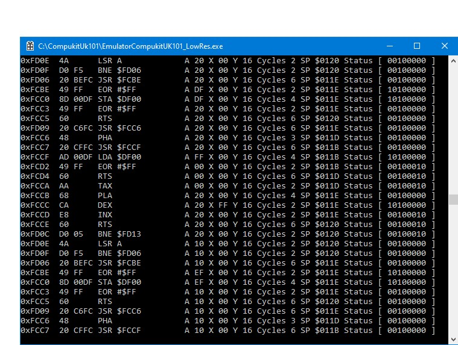
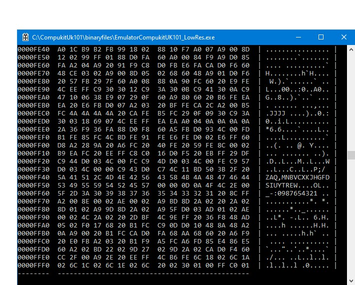

# Compukit-Uk101-Emulator
Emulator 6502 and Hardware for a Compukit Uk101 with screen resolution sizes of 48x16 or 48x32 or 48x48

with source code and library.

History

The UK101 design was published in Practical Electronics, a popular hobbyists magazine at the time. The August, September, October and November 1979 issues carried the four parts of the article, authored by Dr A. A. Berk. Later issues of the magazine contained information on modifications and additions to the machine, including a series of articles on building an expansion unit.

Kits of parts for building the machine were available from CompShop Ltd of 14 Station Road, Barnet, Hertfordshire. It is thought that around 5000 kits were produced.
in 1979 i spent all night building my kit and had many hours of fun.
In the Coronavirus lockdown brush up my programming skills and here we are with a Compukit-Uk101-Emulator
